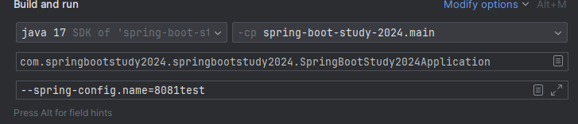

# Part.2 스프링 부트 공통 작업

## 애플리케이션 설정 관리

* 개발을 하다보면, 소스 코드는 동일하지만 복잡한 환경(dev,release,main)에 맞춰서 환경을 관리해야 하는 상황에 놓여질 수 있다.
* Spring Boot에서는 다양한 설정 방법을 제공한다. 여기서는 기본적인 설정들에 대해서 알아본다.

### 1. SpringApplication 클래스 사용

* SpringApplication 클래스에서는 Properties 혹은 Map<String, Object>를 받는 setDefaultProperties() 메소드가 있는데,
  이를 이용해서 처음에 환경 값을 설정 할 수 있다.
* 외부 값에 의존하지 않고 소스 코드에 집어넣는 방식이므로 한 번 정의하고 바뀌지 않는 방식에 유리하다.

### 2. @PropertySource 사용하기

* Configuration 클래스에 직접 PropertySource를 이용해서 임의의 .properties 파일의 값을 가져와 사용할 수 있다.
* 하나의 Configuration 클래스에 여러 Property를 할당해서 사용하는 것 또한 가능하다.

### 3. 환경 설정 파일

* 스프링 부트는 환경 설정 정보를 application.properties 또는 application.yml에서 지정할 수 있다.
* 파일에서 정의된 값들은 스프링의 Environment 객체에 로딩되고 어플리케이션에서 Environment에 접근해서 사용하거나
  @Value 어노테이션을 통해 사용할 수 있다.
* 만약 application.{yml, properties}가 아닌 다른 이름을 사용하고 싶다면, 스프링을 실행할 때 실행 인자에
  spring.config.name을 이용해서 이름을 바꿀 수도 있다.
* 아래는 예시
  
* 기본적으로 스프링 부트는 아래와 같은 경로들을 탐색해서 설정 파일을 찾는다
  1. 클래스패스 루트
  2. 클래스패스 /config 패키지
  3. 현재 디렉터리
  4. 현재 디렉터리의 /config 디렉터리
  5. /config 디렉터리의 바로 하위 디렉터리
* 이 외의 경로에 두고 싶다면, spring.config.location 인자를 통해 경로를 직접 재설정할 수 있다.
* 스프링 부트는 어플리케이션을 실행할 때 profile을 정할 수 있는데 profile 별로 다른 yml을 사용하게 할 수 있다.
* application-{profile}.properties의 이름 형태로 설정을 작성하면 되고 만약 여러 설정을 동시에 불러올 수 있는 경우가 된다면
  아래의 순서를 따라 늦게 적용되는 쪽이 적용된다.
  1. JAR 파일 안에 패키징 되는 application.yml
  2. JAR 파일 안에 패키징되는 application-{profile}.yml
  3. JAR 파일 밖에서 패키징되는 application.yml
  4. JAR 파일 밖에서 패키징되는 application-{profile}.yml

### 4. 운영 체재 환경 변수

* application.properties에서는 운영 체제의 환경 변수 또한 가져올 수 있다.
* 윈도우에서는 set <VAR>=<VALUE> 형식으로, 리눅스에서는 export <VAR>=<VALUE> 형식으로 환경 변수 지정이 가능하다.
* 설정 내에서는 app.timeout=${APP_TIMEOUT} 이런 식으로 호출된다.

## @ConfigurationProperties로 커스텀 프로퍼티 만들기

* 스프링 부트의 설정은 크게 빌트인 프로퍼티와 커스텀 프로퍼티로 나뉜다.
* 빌트인 프로퍼티의 대표적인 예는 server.port로 빌트인 프로퍼티 목록은 https://mng.bz/q2Gw 에서 확인 가능하다.
* 앞에서 제시했던 Environment를 직접 주입받는 방법은 몇몇 단점이 있다.
  1. 프로퍼티 값의 타입 안정성이 보장되지 않음
  2. 프로퍼티를 일정한 단위로 묶어서 읽을 수 없고 하나하나 불러와야 한다.
* 커스텀 프로퍼티는 이와 같은 단점들을 해결해준다.

### @ConfigurationProperties를 이용한 구현

* 시작 전, 이 기능을 이용하려면 org.springframework.boot:spring-boot-configuration-processor 의존성이 필요하다.
* yml(properties)에 본인이 원하는 prefix를 달아 옵션을 적어두면 어노테이션을 이용해 값을 불러올 수 있다.
* Kotlin에서는 data class를 이용해서도 값을 가져올 수 있다. 해당 내용은 예시 참조
* ConfigurationProperties를 이용하려면 추가로 @EnableConfigurationProperties를 이용해 하나하나 configuration을 추가하거나
  ConfigurationPropertiesScan 어노테이션을 이용해 클래스 스캔 범위를 지정해줘야한다.
* 이렇게하면 서버가 켜질 때 타입 안정성을 보장받을 수 있으므로 프로그램의 안정성이 올라간다.
* 기본적으로 구현은 var로 구현되지만 불변성을 보장하고 싶으면 @ConstructorBinding 을 이용해 val로 선언을 할 수 있다.

## 스프링부트 시작 시 코드 실행

* 어플리케이션을 시작하기 전에 특정 코드를 실행해야 할 때가 있다. 이 때 CommandLineRunner를 이용해서 이를 구현할 수 있다.
* CommandLineRunner는 크게 3가지 방식으로 구현할 수 있다.
  1. CommandLineRunner를 상속하는 스프링부트 메인 클래스 구현
  2. CommandLineRunner 구현체에 @Bean을 붙여서 구현
  3. CommandLineRunner 구현체에 @Component를 붙여서 구현
* 1번 방법의 경우 메인 클래스가 복잡해질 수 있으니 2번과 3번 방법을 통해서 구현하는 것을 추천한다.
* 인자로 넘겨지는 args의 경우 어플리케이션을 실행할 때 받는 명령행 인자이다.
* Order 어노테이션을 이용해서 commandLineRunner의 실행 순서를 정할 수도 있다.
* CommandLineRunner는 스프링의 빈 초기화가 모두 끝난 뒤 실행되므로 빈을 주입받아서 사용할 수도 있다.

#### Bean과 Component의 차이

* 큰 차이는 없으나, Component는 프로젝트 내에서 소스 코드에 접근할 수 있을 때 사용하고 Bean은 직접 소스 코드에 접근할 수 없을 때
  해당 인스턴스를 반환하는 메소드를 작성하고 그 메소드를 @Bean을 이용해 등록하게 해준다.

## 스프링 부트 애플리케이션 로깅 커스터마이징

### 로깅의 이해 및 커스터마이징

* 스프링부트에서 콘솔로그는 기본적으로 제공된다.
* 내부적으로는 아파치 커먼즈 로깅 프레임워크를 사용하지만 다른 기타 로깅 프로그램 또한 지원한다.
* spring-boot-starter 의존 관계를 사용한다면 기본적으로 start-boot-starter-logging이 포함되므로 이 안에 있는
  로그백을 사용할 수 있다.
* 스프링 로그는 다음과 같은 정보를 가진다
  * 일시 - 로그가 출력되는 시간
  * 로그 레벨 - 로그의 중요도를 표시하며 FATAL, ERROR, WARN, INFO, DEBUG, TRACE로 나뉜다.
  * 프로세스 ID
  * 구분자
  * 스레드 이름
  * 로거 이름
  * 메시지
* 로거는 yml에서 logging.pattern.console 값을 수정해 직접 커스터마이징 할 수도 있다.
* 별다른 설정이 없다면 스프링은 INFO, WARN, ERROR 레벨을 사용한다.
* 개발과 달리 실제 운영에서는 로깅 데이터를 파일로 출력하는 경우가 많다. 이 때 logging.file.name이나 logging.file.path를
  추가하면 자동적으로 파일에 로그가 출력된다.
* 스프링부트는 기본적으로 하루가 지나거나, 10MB가 넘으면 다음 로그 파일을 출력한다. 이 또한 yml에서 설정으로 변경할 수 있다.

### Log4j2를 사용하여 로깅하기

* Log4j2를 사용하려면 스프링 스타터에 있는 로그백 의존성을 제외한 뒤에 log4j2의 의존성을 추가해줘야 한다.
* log4j2 설정은 xml이나 yml로 할 수 있으며 스프링에게 완전히 제어권을 넘기기 위해 이름은 log4j2-spring.xml으로 하는 것이 좋다.
