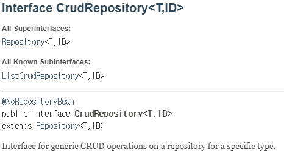
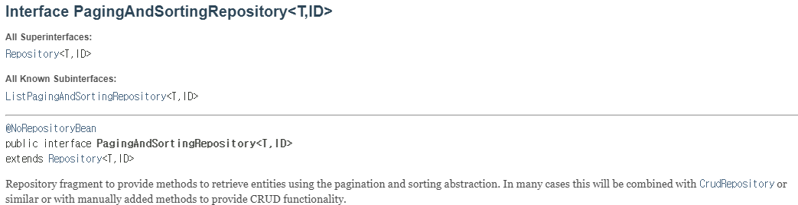

# 3.3장 - CrudRepository 인터페이스 이해  
<hr/>

https://docs.spring.io/spring-data/commons/docs/current/api/org/springframework/data/repository/CrudRepository.html



T = repository가 관리하는 도메인 타입을 나타내는 제네릭 타입 매개변수  
ID = 엔티티의 ID의 타입  

- Repository<T, ID> : Spring Data의 모든 repository 인터페이스의 최상위 (마커) 인터페이스
- ListCrudRepository<T,ID> : CrudRepository의 하위 인터페이스 중 하나로 CrudRepository의 기능을 포함하면서, 반환 타입이나 메서드 파라미터에서 List를 사용하는 추가 메서드를 제공

| Modifier and Type           | Method                                      | Description                                             |                                  |
|-----------------------------|---------------------------------------------|---------------------------------------------------------|----------------------------------|
| long                        | count()                                     | Returns the number of entities available.               | 사용 가능한 엔티티 수를 반환합니다.             |
| void                        | delete(T entity)                            | Deletes a given entity.                                 | 주어진 엔티티를 삭제합니다.                  |
| void                        | deleteAll()                                 | Deletes all entities managed by the repository.         | 저장소에서 관리하는 모든 엔티티를 삭제합니다.        |
| void                        | deleteAll(`Iterable<? extends T>` entities) | Deletes the given entities.                             | 주어진 엔티티들을 삭제합니다.                 |
| void                        | deleteAllById(`Iterable<? extends ID>` ids) | Deletes all instances of the type T with the given IDs. | 주어진 ID를 가진 타입 T의 모든 인스턴스를 삭제합니다. |
| void                        | deleteById(ID id)                           | Deletes the entity with the given id.                   | 주어진 id를 가진 엔티티를 삭제합니다.           |
| boolean                     | existsById(ID id)                           | Returns whether an entity with the given id exists.     | 주어진 id를 가진 엔티티가 존재하는지 여부를 반환합니다. |
| Iterable<T>                 | findAll()                                   | Returns all instances of the type.                      | 해당 타입의 모든 인스턴스를 반환합니다.           |
| Iterable<T>                 | findAllById(`Iterable<ID>` ids)             | Returns all instances of the type T with the given IDs. | 주어진 ID를 가진 타입 T의 모든 인스턴스를 반환합니다. |
| Optional<T>                 | findById(ID id)                             | Retrieves an entity by its id.                          | ID로 엔티티를 검색합니다.                  |
| `<S extends T>` S           | save(S entity)                              | Saves a given entity.                                   | 주어진 엔티티를 저장합니다.                  |
| `<S extends T>` Iterable<S> | saveAll(`Iterable<S>` entities)             | Saves all given entities.                               | 주어진 모든 엔티티를 저장합니다.               |


## 3.3.1 - 스프링 데이터 JPA, 도메인 객체를 관계형 데이터베이스에서 관리

- Course entity 
```kotlin
@Entity
@Table(name = "COURSES")
class Course(
    @Id
    @Column(name = "ID")
    @GeneratedValue(strategy = GenerationType.IDENTITY)
    var id: Long = 0,

    @Column(name = "NAME")
    var name: String? = null,

    @Column(name = "CATEGORY")
    var category: String? = null,

    @Column(name = "RATING")
    var rating: Int = 0,

    @Column(name = "DESCRIPTION")
    var description: String? = null
) {
    constructor(name: String, category: String, rating: Int, description: String) : this() {
        this.name = name
        this.category = category
        this.rating = rating
        this.description = description
    }

    override fun equals(other: Any?): Boolean {
        if (this === other) return true
        if (other == null || this::class != other::class) return false

        other as Course

        if (name != other.name) return false
        if (category != other.category) return false

        return true
    }

    override fun hashCode(): Int {
        var result = name?.hashCode() ?: 0
        result = 31 * result + (category?.hashCode() ?: 0)
        return result
    }

    override fun toString(): String {
        return "Course(id=$id, name=$name, category=$category, rating=$rating, description=$description)"
    }
}
```

- CourseRepository interface
```kotlin
@Repository
interface CourseRepository : CrudRepository<Course, Long>
```
-> 런타임에 인터페이스 구현체를 자동으로 만들어준다.

- crud 연산 단위 테스트
```kotlin
@SpringBootTest
class CourseTrackerSpringBootApplicationTests {

  @Autowired
  private lateinit var courseRepository: CourseRepository

  @Test
  fun givenCreateCourseWhenLoadTheCourseThenExpectSameCourse() {
    val course = Course("Rapid Spring Boot Application Development", "Spring", 4, "'Spring Boot gives all the power of the Spring Framework without all of the complexities")
    val savedCourse = courseRepository.save(course)
    assertThat(courseRepository.findById(savedCourse.id).get()).isEqualTo(course)
  }

  @Test
  fun givenUpdateCourseWhenLoadTheCourseThenExpectUpdatedCourse() {
    val course = Course("Rapid Spring Boot Application Development", "Spring", 4, "'Spring Boot gives all the power of the Spring Framework without all of the complexities")
    courseRepository.save(course)
    course.rating = 5
    val savedCourse = courseRepository.save(course)
    assertThat(courseRepository.findById(savedCourse.id).get().rating).isEqualTo(5)
  }

  @Test
  fun givenDeleteCourseWhenLoadTheCourseThenExpectNoCourse() {
    val course = Course("Rapid Spring Boot Application Development", "Spring", 4, "'Spring Boot gives all the power of the Spring Framework without all of the complexities")
    val savedCourse = courseRepository.save(course)
    assertThat(courseRepository.findById(savedCourse.id).get()).isEqualTo(course)
    courseRepository.delete(course)
    assertThat(courseRepository.findById(savedCourse.id).isPresent).isFalse()
  }
}
```

- 토론: repository 인터페이스에 @Repository annotation을 붙이는 2가지 목적
- 1. 자동 감지 - @Component annotation 포함
- 2. 예외 변환 - JPA구현체에 따라 달라지는 예외를 DataAccessException으로 변환해준다  

## 3.3.2 - 커스텀 스프링 데이터 리포지터리 만들기 

 - 문제 : 모든 CRUD를 노출하고 싶지 않다. 
 - 해결 : 커스텀 스프링 데이터 repository를 만든다.
 - 어떻게 :
1. 커스텀 BaseRepository 인터페이스 정의 

```kotlin
@NoRepositoryBean 
interface BaseRepository<T, ID : Serializable> : CrudRepository<T, ID> {
  override fun <S : T> save(entity: S): S
  fun findById(id: ID): Optional<T>
  fun findAll(): Iterable<T>
}
```

2. CrudRepository 대신에 BaseRepository 상속하기  

```kotlin
@Repository
interface CourseRepository : BaseRepository<Course, Long>
```

# 3.4장 - 스프링 데이터를 사용한 데이터 조회  
### DB에 저장된 데이터를 효율적으로 활용하는 법

## 3.4.1 - 쿼리 메서드 정의

- 문제 : ID가 아닌 다른 프로퍼티로 조회하고 싶다. list, startswith, containing 등의 조건을 걸고 싶다. 정렬하고 싶다.
- 해결 : 메서드 이름을 특정 패턴에 맞게 작성하면 스프링 데이터가 메서드 이름을 파싱해서 쿼리를 만들어 실행한다.

1. **기본 쿼리**:
  - 사용자 이름으로 사용자 찾기.
   ```kotlin
   fun findByUsername(username: String): User?
   ```
2. **여러 매개변수를 가진 쿼리**:
- 제목과 저자로
```kotlin
fun findByTitleAndAuthor(title: String, author: String): List<Book>
```
3. **정렬을 포함한 쿼리**:
- 가격이 오름차순으로 정렬된 모든 제품
```kotlin
fun findAllByOrderByPriceAsc(): List<Product>
```
4. **커스텀 조건으로**:
- 나이가 특정 값보다 큰 사용자
```kotlin
fun findByAgeGreaterThan(age: Int): List<User>
```
5. **IN 을 포함한 쿼리**:
- 특정 ID를 가진 사용자
```kotlin
fun findByIdIn(ids: List<Long>): List<User>
```

## 3.4.2 - 커스텀 쿼리 메서드

```kotlin
@Repository
interface CourseRepository : CrudRepository<Course, Long> {

  fun findAllByCategory(category: String): Iterable<Course>

  fun findAllByCategoryOrderByName(category: String): Iterable<Course>

  fun existsByName(name: String): Boolean

  fun countByCategory(category: String): Long

  fun findByNameOrCategory(name: String, category: String): Iterable<Course>

  fun findByNameStartsWith(name: String): Iterable<Course>

  fun streamAllByCategory(category: String): Stream<Course>
}
```

https://docs.spring.io/spring-data/jpa/reference/jpa/query-methods.html

## 3.4.3 - PagingAndSortingRepository를 활용한 페이징

- pagination - 많은 양의 데이터를 여러 페이지로 나눠 조회하는 기법  
- 문제 : 전체 데이터양이 많은 경우 처리 시간이 오래 걸리고 리소스를 많이 사용한다.
- 해결 : CrudRepository를 상속받은 PagingAndSortingRepository를 사용하자.

## 3.4.4 - PagingAndSortingRepository 인터페이스로 페이징 및 정렬 

```kotlin
// @Repository
// interface CourseRepository : PagingAndSortingRepository<Course, Long>

@DataJpaTest
class CourseTrackerSpringBootApplicationTests {

  @Autowired
  private lateinit var courseRepository: CourseRepository

  @Test
  fun `givenDataAvailableWhenLoadFirstPageThenGetFiveRecords`() {
    val pageable = PageRequest.of(0, 5)
    assertThat(courseRepository.findAll(pageable)).hasSize(5)
    assertThat(pageable.pageNumber).isEqualTo(0)

    val nextPageable = pageable.next()
    assertThat(courseRepository.findAll(nextPageable)).hasSize(4)
    assertThat(nextPageable.pageNumber).isEqualTo(1)
  }

  @Test
  fun `givenDataAvailableWhenSortsFirstPageThenGetSortedData`() {
    val pageable = PageRequest.of(0, 5, Sort.by(Sort.Order.asc("Name")))
    val sortedFirstCourseCondition = Condition<Course> { course ->
      course.id == 4L && course.name == "Cloud Native Spring Boot Application Development"
    }
    assertThat(courseRepository.findAll(pageable)).first().has(sortedFirstCourseCondition)
  }

  @Test
  fun `givenDataAvailableWhenApplyCustomSortThenGetSortedResult`() {
    val customSortPageable = PageRequest.of(0, 5, Sort.by("Rating").descending().and(Sort.by("Name")))
    val customSortFirstCourseCondition = Condition<Course> { course ->
      course.id == 2L && course.name == "Getting Started with Spring Security DSL"
    }
    assertThat(courseRepository.findAll(customSortPageable)).first().has(customSortFirstCourseCondition)
  }
}
```

## 3.4.6 - NamedQuery 사용하기
- 문제 - 앞에서 살펴본 이름과 파라미터로 쿼리를 유추하는 방식은 한계가 있다. join ...
- 해결 - NamedQuery를 사용하자.

```kotlin
@Entity
@Table(name = "COURSES")
@NamedQuery(name = "Course.findAllByCategoryAndRating", query = "select c from Course c where c.category=?1 and c.rating=?2")
class Course(
    @Id
    @GeneratedValue(strategy = GenerationType.IDENTITY)
    @Column(name = "ID")
    var id: Long = 0,

    @Column(name = "NAME")
    var name: String? = null,

    @Column(name = "CATEGORY")
    var category: String? = null,

    @Column(name = "RATING")
    var rating: Int = 0,

    @Column(name = "DESCRIPTION")
    var description: String? = null
) {
    constructor(name: String, category: String, rating: Int, description: String) : this() {
        this.name = name
        this.category = category
        this.rating = rating
        this.description = description
    }

    override fun equals(other: Any?): Boolean {
        if (this === other) return true
        if (other == null || javaClass != other.javaClass) return false

        other as Course

        if (name != other.name) return false
        if (category != other.category) return false

        return true
    }

    override fun hashCode(): Int {
        return Objects.hash(name, category)
    }

    override fun toString(): String {
        return "Course(id=$id, name=$name, category=$category, rating=$rating, description=$description)"
    }
}
```
- NamedQuery annotation은 여러 개 사용할 수 있다.
  
```kotlin
@Repository
interface CourseRepository : CrudRepository<Course, Long> {
    fun findAllByCategoryAndRating(category: String, rating: Int): Iterable<Course>
}
```

# 3.5장 - @Query로 쿼리문 지정 
- 문제 - NamedQuery의 단점 = 필요하지 않은 데이터도 도메인 클래스에 추가한다.
- 해결 - 쿼리 정보를 도메인 클래스가 아니라 repository 클래스에 추가하자.

## 3.5.1 - @Query로 쿼리 정의하고 도메인 객체를 조회


```kotlin
@Repository
interface CourseRepository : CrudRepository<Course, Long> {

  @Query("select c from Course c where c.category=?1")
  fun findAllByCategory(category: String): Iterable<Course>

  @Query("select c from Course c where c.category=:category and c.rating > :rating")
  fun findAllByCategoryAndRatingGreaterThan(
    @Param("category") category: String,
    @Param("rating") rating: Int
  ): Iterable<Course>

  @Query(value = "select * from COURSE where rating=?1", nativeQuery = true)
  fun findAllByRating(rating: Int): Iterable<Course>

  @Modifying
  @Transactional
  @Query("update Course c set c.rating=:rating where c.name=:name")
  fun updateCourseRatingByName(
    @Param("rating") rating: Int,
    @Param("name") name: String
  ): Int
}
```

- 문제 - 쿼리문이 잘못된 경우 런타임 에러가 발생한다.
