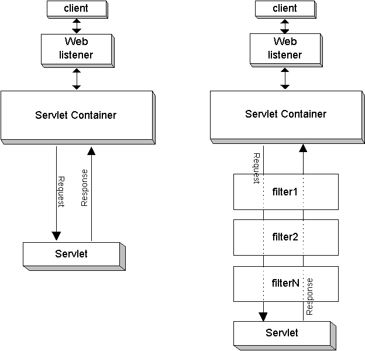
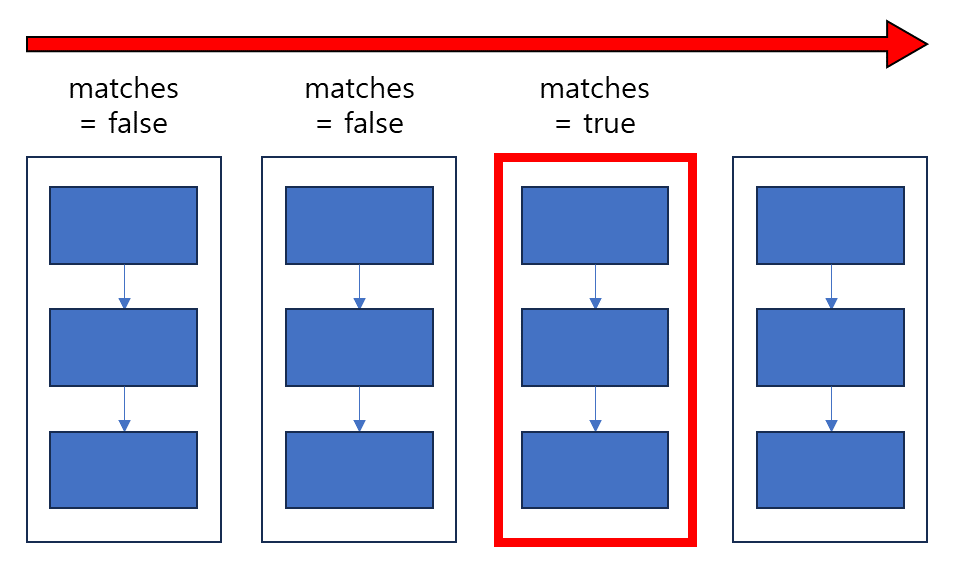

# 5. 스프링 부트 애플리케이션 보안

## 5.1 스프링 시큐리티 소개
스프링 시큐리티가 제공하는 보안 기능들
- 애플리케이션 사용자 인증
- 별도 로그인 페이지가 없을 때 사용할 수 있는 기본 로그인 페이지
- 폼 기반 로그인에 사용할 수 있는 기본 계정
- 패스워드 암호화에 사용할 수 있는 여러 가지 인코더
- 사용자 인증 성공 후 세션 ID를 교체해서 세션 고정 공격 방지
- HTTP 응답 코드에 랜점 문자열 토큰을 포함해서 사이트 간 요청 위조(CSRF) 공격 방지
- 공통적으로 자주 발생하는 보안 공격을 방어할 수 있는 여러 가지 HTTP 응답 헤더 제공
    - Cache-Control: 브라우저 캐시를 완전히 비활성화
    - X-Content-Type-Options: 브라우저의 콘텐트 타입 추측을 비활성화하고 Content-Type 헤더로 지정된 콘텐트 타입으로만 사용하도록 강제
    - Strict-Transport-Security: 응답 헤더에 포함되면 이후 해당 도메인에 대해서는 브라우저가 자동으로 HTTPS를 통해 연결하도록 강제하는 HSTS 활성화
    - X-Frame-Options: 값을 DENY로 설정하면 웹 페이지 콘텐트가 frame, iframe, embed에서 표시되지 않도록 강제해서 클릭재킹 공격 방지
    - X-XSS-Protection: 값을 1; mode=block으로 설정하면 브라우저의 XSS필터링을 활성화하고 XSS공격이 감지되면 해당 웹 페이지를 로딩하지 않도록 강제

## 5.2 스프링 부트와 스프링 시큐리티

### 5.2.1 스프링 부트 애플리케이션에서 스프링 시큐리티 활성화
`spring-boot-starter-security` 의존 관계 추가

### 5.2.2 필터, 필터체인과 스프링 시큐리티
- 필터: 서블릿의 앞 단에 위치해서, 요청-응답 객체를 가로채서 변경할 수 있음
- 필터체인: 여러 개의 필터를 chaining 한 것



```java
public interface Filter {
  default void init(FilterConfig filterConfig) throws ServletException { }
  
  void doFilter(ServletRequest request, ServletResponse response, FilterChain chain)
    throws IOException, ServletException;
  
  default void destroy() { }
}
```
- init(): 서블릿 컨테이너가 필터를 등록하는 초기화 과정에서 호출
- destroy(): 서블릿 컨테이너가 필터를 제거할 때 호출
- doFilter(): 필터의 실질적인 작업을 수행
```java
public interface FilterChain {
  void doFilter(ServletRequest request, ServletResponse response)
    throws IOException, ServletException;
}
```

### 5.2.3 스프링 시큐리티 아키텍처
- DelegatingFilterProxy: 서블릿 컨테이너에 등록되는 특별한 필터로, 스프링 빈 필터에 위임
- FilterChainProxy: 스프링 빈으로 등록되는 필터로, 적합한 SecurityFilterChain에 요청을 보냄
- SecurityFilterChain: matches(), getFilters() 메소드 제공

- `@Order`: SecurityFilterChain 사이의 우선 순위 설정

- DelegatingFilterProxy 소스: https://github.com/spring-projects/spring-framework/blob/main/spring-web/src/main/java/org/springframework/web/filter/DelegatingFilterProxy.java
- FilterChainProxy 소스: https://github.com/spring-projects/spring-security/blob/main/web/src/main/java/org/springframework/security/web/FilterChainProxy.java

### 5.2.4 사용자 인증
- SecurityContextHolderFilter가 먼저 요청을 받음
-> SecurityContextRepository를 통해 SecurityContext를 조회
-> SecurityContextHolder에 추가 -> 이후 인증 필터에서 처리

SecurityContextPersistenceFilter 소스: https://github.com/spring-projects/spring-security/blob/main/web/src/main/java/org/springframework/security/web/context/SecurityContextPersistenceFilter.java

참고: https://img1.daumcdn.net/thumb/R1280x0/?scode=mtistory2&fname=https%3A%2F%2Fblog.kakaocdn.net%2Fdn%2FbYEodl%2FbtrZNv0vgRv%2F8DNRmvHDLlegGjv4E93av1%2Fimg.png


#### 인증 필터에서의 인증 처리 과정
1. 요청에 포함된 정보를 토대로 인증 토큰 생성
2. AuthenticationManager.authenticate(token)
3. AuthenticationManager이 가지고 있는 AuthenticationProvider 인스턴스 목록에 대해, AuthenticationProvider.supports(token)이 true일 때 AuthenticationProvider.authenticate(token)호출
4. token에서 username 추출 후 UserDetailsService.loadUserByUsername(username)으로 UserDetails 획득 및 return
5. AuthenticationProvider는 UserDetails를 토대로 인증 수행, 성공 시 Authentication을 return
6. AuthenticationManager는 비밀 정보 삭제 후 필터에 return
7. 필터는 Authentication을 SecurityContextHolder에 저장
8. 클라이언트에 응답 반환하기 전에 repo.saveContext()

- ProviderManager 소스: https://github.com/spring-projects/spring-security/blob/main/core/src/main/java/org/springframework/security/authentication/ProviderManager.java

### 5.2.5 스프링 시큐리티 자동 구성
- SecurityAutoConfiguration
  - SpringBootWebSecurityConfiguration: 커스텀 시큐리티 설정을 추가하지 않았을 때 사용. 폼 로그인 기능, http 기본 인증 포함하는 SecurityFilterChain 빈 생성
  - WebSecurityEnablerConfiguration: `@EnableWebSecurity`
      - WebSecurityConfiguration: WebSecurity 빈 생성(이미지, css, js 같은 웹 리소스에 대한 보안 설정)
      - HttpSecurityConfiguration: HttpSecurity 빈 생성(http 요청에 대한 보안 설정)
      - `@EnableGlobalAuthentication`: AuthenticationManager를 AuthenticationManagerBuilder 인스턴스 사용해 설정할 수 있도록 함
      - 커스텀 스프링 시큐리티 설정 파일을 작성하고 @EnableWebSecurity 붙이면 이 클래스는 무시됨
  - SecurityDataConfiguration: 스프링 시큐리티와 스프링 데이터를 연동할 때 사용
- UserDetailsServiceAutoConfiguration: UserDetailsService가 빈으로 등록되어 있지 않을 때 InMemoryUserDetailsManager를 등록, 기본 계정이 포함되어 있음
- SecurityFilterAutoConfiguration: DelegatingFilterProxyRegistrationBean을 생성. DelegatingFilterProxy를 서블릿 컨테이너에 등록해 줌
