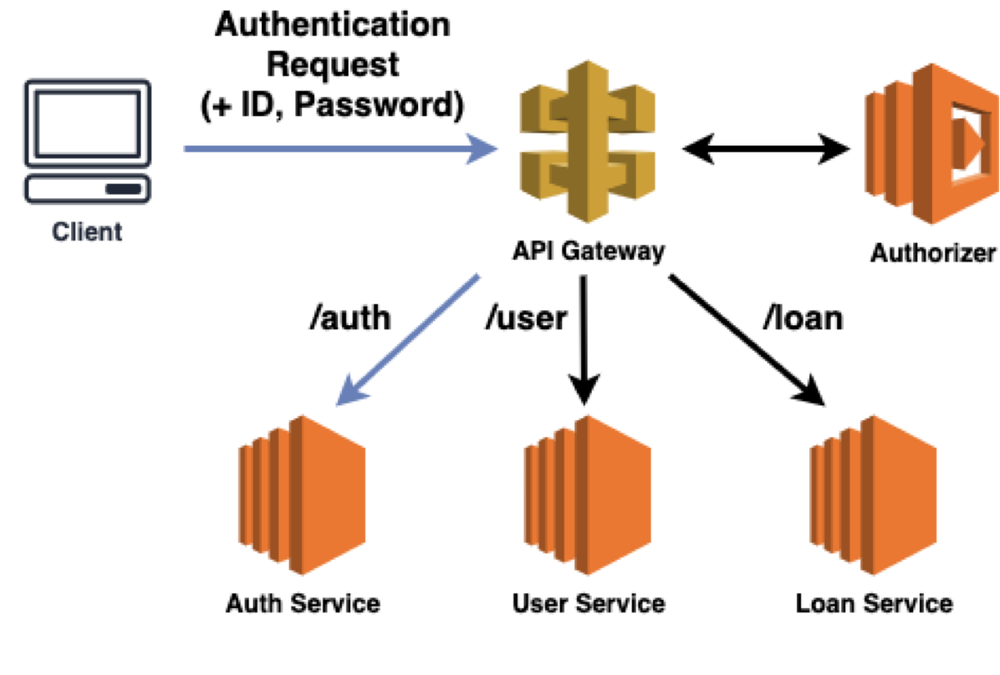
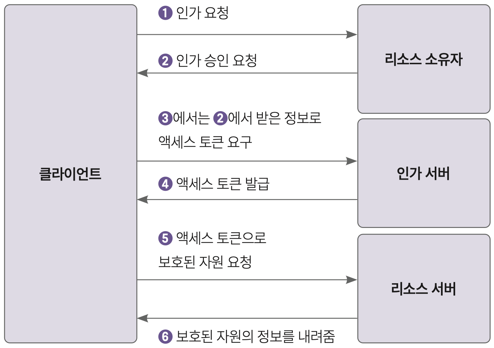

# 7.5 RESTful API 버저닝

- "V2 해주세요"? 캐시리뷰.
- 질문: 왜 버저닝이 필요한가?
- 질문: 여러분은 현재 버저닝을 하고 있나요?
- 질문: 버저닝을 한다면, 어떤 방식으로 버저닝을 할 것인가?

1. URI 버저닝
2. 요청 파라미터 버저닝
3. 커스텀 HTTP 헤더 버저닝
4. 미디어 타입 버저닝

## 7.5.1 URI 버저닝

- RequestMapping에 버전을 명시

- v1

```kotlin
@RestController
@RequestMapping("/courses/v1")
public class CourseControllerV1 {
    //...
}
```

- v2

```kotlin
@RestController
@RequestMapping("/courses/v2")
public class CourseControllerV2 {
    //...
}
```

## 7.5.2 요청 파라미터 버저닝

- RequestParam에 버전을 명시

- v1

```kotlin
@RestController
@RequestMapping("/courses")
public class CourseController {
    @GetMapping(params = "version=1")
    public List<Course> getAllCoursesV1() {
        //...
    }
}
```

- v2

```kotlin
@RestController
@RequestMapping("/courses")
public class CourseController {
    @GetMapping(params = "version=2")
    public List<Course> getAllCoursesV2() {
        //...
    }
}
```

## 7.5.3 커스텀 HTTP 헤더 버저닝

- RequestHeader에 버전을 명시

- v1

```kotlin
@RestController
@RequestMapping("/courses")
public class CourseController {
    @GetMapping(headers = "X-API-VERSION=1")
    public List<Course> getAllCoursesV1() {
        //...
    }
}
```

- v2

```kotlin
@RestController
@RequestMapping("/courses")
public class CourseController {
    @GetMapping(headers = "X-API-VERSION=2")
    public List<Course> getAllCoursesV2() {
        //...
    }
}
```

## 7.5.4 미디어 타입 버저닝

- Accept 헤더에 버전을 명시

- v1

```kotlin
@RestController
@RequestMapping("/courses")
public class CourseController {
    @GetMapping(produces = "application/vnd.company.app-v1+json")
    public List<Course> getAllCoursesV1() {
        //...
    }
}
```

- v2

```kotlin
@RestController
@RequestMapping("/courses")
public class CourseController {
    @GetMapping(produces = "application/vnd.company.app-v2+json")
    public List<Course> getAllCoursesV2() {
        //...
    }
}
```

## 버저닝 방식 선택

**\*어떤 방식도 완벽하지 않음. 상황에 따라 선택해야 한다.**

- URI 버저닝

  - 특징: API 버전이 명확하게 구분.
  - 주의할 점: 새 버전을 배포할 때마다 기존의 URI 구조를 변경해야 하므로, 클라이언트에게 영향을 줄 수 있음.
  - 접합한 경우: API의 주요 변경이 있을 때 사용하기 좋으며, 사용자가 버전별로 명확하게 구분해서 사용해야 할 경우 적합.

- 요청 파라미터 버저닝

  - 특징: 여러 버전의 API를 동시에 유지보수하기 쉬움.
  - 주의할 점: 버전 정보가 URL에 명시적으로 보이지 않아 직관적이지 않을 수 있음 (캐싱이 어려울 수 있음).
  - 접합한 경우: 소규모 변경이나 후방 호환성이 중요한 경우에 적합합니다. 클라이언트가 버전을 쉽게 전환할 수 있어야 할 때 유용.

- 커스텀 HTTP 헤더 버저닝

  - 특징: 요청 파라미터 버저닝과 유사한 장점과 단점을 가짐.
  - 주의할 점: 헤더를 사용해야 하므로, 테스트와 문서화가 더 복잡할 수 있습니다.
  - 접합한 경우: API의 변경이 클라이언트에게 투명해야 하거나, URL을 깔끔하게 유지하고 싶을 때 적합.

- 미디어 타입 버저닝
  - 특징: HTTP 표준을 활용하는 깔끔한 방식.
  - 주의할 점: 클라이언트 구현이 더 복잡.
  - 접합한 경우: 다양한 데이터 형식 지원 필요, 버전 변경이 빈번하며 투명한 관리 필요, 세밀한 버전 관리 필요, 표준 준수 및 확장성 중요시할 때 적합.

## 버저닝 예시

- 아마존: HTTP 요청 파라미터.
  - 이유: 소규모 변경이나 후방 호환성.
- 깃허브: 미디어 타입.
  - 이유: 표준 준수 및 확장성 중요.
- 마이크로소프트: 커스텀 헤더.
  - 이유: 투명한 관리.
- 트위터: URI.
  - 이유: 버전이 명확하게 구분.

# 7.6 RESTful API 보안

- HTTP 기본 인증

  - 문제: 기본 인증 정보 (ID, PW)가 Base64로 인코딩되어 전송되므로, 보안에 취약. SSL/TLS를 사용하지 않으면 더 취약.

- 책에서는 중앙화된 인가(Authorization) 서버 사용을 권장. (Keycloak)
- 하지만 Keycloak 사용방법은 발표시간에 다루기에 너무 길어서 생략 -> 대신 인증 자체에 대한 이야기를 진행.

<br>

- 인가 서버 사용:
  

<br>

- 인가 서버 사용 (In Detail):
  

- 요즘에는 토큰 기반의 인증, 외부 인증 서비스 (OAuth, Auth0, Firebase)를 사용하는 것이 일반적.

- 토큰 기반의 인증
  - 토큰: 클라이언트가 서버에 자신을 인증하기 위해 사용하는 정보.
  - 토큰은 서버가 발급하며, 클라이언트는 이를 저장해두고, 서버에 요청을 보낼 때마다 토큰을 함께 보냄.
  - 서버는 토큰을 검증하고, 클라이언트의 요청을 처리.

## NestJS JWT vs Spring Security JWT

[NestJS vs SpringBoot Performance Comparison for JWT Verify and MySQL Query (Jun 20, 2023)](https://medium.com/deno-the-complete-reference/nestjs-vs-springboot-performance-comparison-for-jwt-verify-and-mysql-query-731c6a3ce16)

- NestJS
  - Interpreted: no compilation, sometimes result in slower execution speeds.
- SpringBoot

  - Compiled: faster execution speeds.

- JWT verification은 CPU-intensive한 작업이므로, compiled language인 SpringBoot가 더 빠르다고 예상.

- 결과: SpringBoot가 NestJS보다 RPS (Requests Per Second)가 높지만, 리소스 (CPU, Memory)를 더 많이 사용함.

<br>

[NestJS vs SpringBoot Performance Comparison for JWT Verify and MySQL Query (Sep 4, 2023)](https://medium.com/deno-the-complete-reference/nestjs-cluster-vs-springboot-performance-comparison-for-jwt-verify-and-mysql-query-670c6250b803)

- 기존의 테스트는 최적화되지 않은 상태에서의 테스트였음.(NestJs는 클러스터 모드을 사용하고, SpringBoot는 가상 스레드를 사용)

- 결과: NestJS가 SpringBoot보다 RPS가 높지만, 리소스를 더 많이 사용함.
